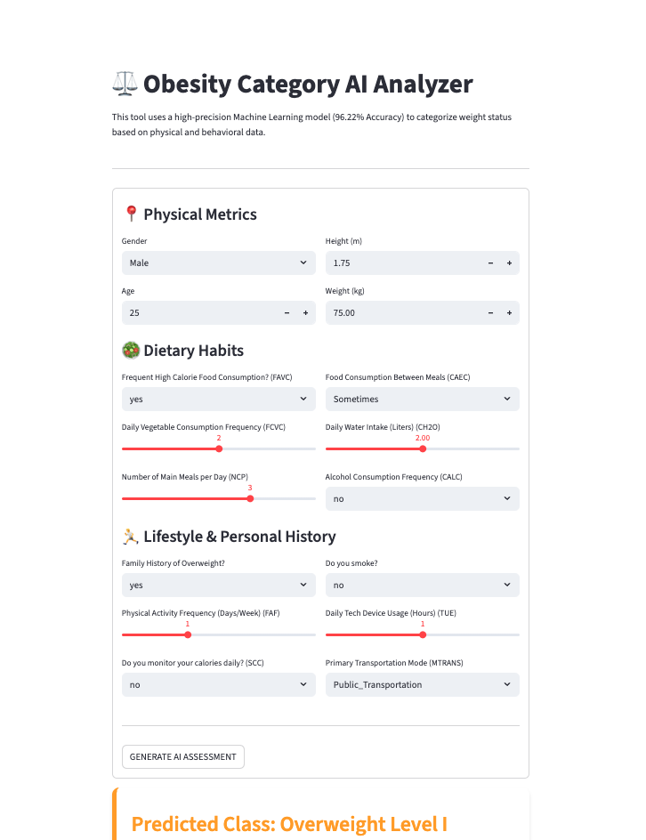

# Obesity Classification AI

A comprehensive machine learning solution that accurately predicts obesity categories using physical metrics, dietary habits, and lifestyle data. The project achieves **96.22% accuracy** through optimized logistic regression and provides an interactive web interface for real-time obesity risk assessment.

[](https://obesity-classification-7r3s7gmmohdf3yhobxhysy.streamlit.app/)

---

## Live Demo

<div align="center">

[](https://obesity-classification-7r3s7gmmohdf3yhobxhysy.streamlit.app/)

<a href="https://obesity-classification-7r3s7gmmohdf3yhobxhysy.streamlit.app/">
  
</a>
</div>

---

## Project Overview

This AI-powered system classifies individuals into **7 distinct obesity categories** ranging from Insufficient Weight to Obesity Type III. The solution combines advanced feature engineering, robust preprocessing pipelines, and hyperparameter-optimized machine learning to deliver medical-grade predictions with high reliability.

### Obesity Categories
- **Insufficient Weight**
- **Normal Weight**
- **Overweight Level I**
- **Overweight Level II**
- **Obesity Type I**
- **Obesity Type II**
- **Obesity Type III**

---

## Architecture

### System Design

```
┌─────────────────────────────────────────────────────────────┐
│                    INPUT DATA LAYER                         │
│  • Physical Metrics (Age, Gender, Height, Weight)           │
│  • Dietary Habits (Meal frequency, Calorie intake, etc.)    │
│  • Lifestyle Factors (Exercise, Tech usage, Transport)      │
└────────────────────┬────────────────────────────────────────┘
                     │
                     ▼
┌─────────────────────────────────────────────────────────────┐
│              PREPROCESSING PIPELINE                         │
│  ┌──────────────────────────────────────────────────┐       │
│  │  1. Feature Engineering                          │       │
│  │     └─ BMI Calculation (Weight/Height²)          │       │
│  ├──────────────────────────────────────────────────┤       │
│  │  2. Data Transformation                          │       │
│  │     ├─ RobustScaler (Numerical features)         │       │
│  │     ├─ OrdinalEncoder (Ordered categories)       │       │
│  │     └─ OneHotEncoder (Nominal categories)        │       │
│  └──────────────────────────────────────────────────┘       │
└────────────────────┬────────────────────────────────────────┘
                     │
                     ▼
┌─────────────────────────────────────────────────────────────┐
│                ML MODEL LAYER                               │
│  ┌──────────────────────────────────────────────────┐       │
│  │  Logistic Regression Classifier                  │       │
│  │  • Solver: lbfgs                                 │       │
│  │  • Regularization: C=100.0                       │       │
│  │  • Multi-class: One-vs-Rest                      │       │
│  │  • Max Iterations: 1000                          │       │
│  └──────────────────────────────────────────────────┘       │
└────────────────────┬────────────────────────────────────────┘
                     │
                     ▼
┌─────────────────────────────────────────────────────────────┐
│              PREDICTION & OUTPUT LAYER                      │
│  • Obesity Category Classification                          │
│  • Confidence Scores                                        │
│  • Personalized Health Insights                             │
└─────────────────────────────────────────────────────────────┘
```

### Data Flow

1. **Data Ingestion**: 17 features collected from user input
2. **Feature Engineering**: BMI calculated dynamically
3. **Preprocessing**: Parallel transformation pipelines (numerical, ordinal, categorical)
4. **Prediction**: Scikit-learn pipeline executes full workflow
5. **Output**: Obesity category with supporting metrics

---

## Tech Stack

### **Core Machine Learning**
- **Python 3.x** - Primary programming language
- **Scikit-learn** - ML model development, preprocessing, and pipeline orchestration
- **Pandas** - Data manipulation and analysis
- **NumPy** - Numerical computations

### **Web Application**
- **Streamlit** - Interactive web interface and deployment
- **Joblib** - Model serialization and loading

### **Data Processing & Visualization**
- **Pandas** - DataFrame operations and data wrangling
- **NumPy** - Array operations and mathematical functions
- **Matplotlib** (via Streamlit) - Data visualization in notebooks

### **Development & Analysis**
- **Jupyter Notebook** - Exploratory data analysis and experimentation
- **IPython** - Enhanced interactive Python shell

### **Model Persistence**
- **Joblib** - Efficient model serialization (`.pkl` format)

### **Version Control**
- **Git** - Source code version control
- **GitHub** - Repository hosting and collaboration

---

## Technologies & Methodologies

### Machine Learning Algorithms
- **Logistic Regression** (Primary classifier)
  - Multinomial classification with lbfgs solver
  - L2 regularization (C=100.0)
  - Optimized through GridSearchCV

### Data Preprocessing Techniques
- **RobustScaler**: Handles outliers in numerical features (Age, BMI, etc.)
- **OrdinalEncoder**: Preserves order in frequency-based features (FCVC, NCP, etc.)
- **OneHotEncoder**: Encodes nominal categories (Gender, Transportation, etc.)
- **Custom Transformers**: BMI calculation using `FunctionTransformer`

### Feature Engineering
- **BMI Derivation**: Weight / Height² formula
- **17 Input Features**: Comprehensive behavioral and physical metrics
- **Domain Knowledge Integration**: Medically relevant feature selection

### Model Optimization
- **Hyperparameter Tuning**: GridSearchCV with 5-fold cross-validation
- **Pipeline Architecture**: End-to-end sklearn Pipeline for reproducibility
- **Column Transformers**: Parallel processing of different feature types

### Validation Strategy
- **Train-Test Split**: 80-20 stratified split
- **Cross-Validation**: 5-fold CV for robust evaluation
- **Metrics**: Accuracy, Precision, Recall, F1-Score, Confusion Matrix

---

## Model Performance

| Metric | Score |
|--------|-------|
| **Test Accuracy** | 96.22% |
| **Cross-Validation Score** | 95.50% |
| **Algorithm** | Logistic Regression |
| **Regularization** | C=100.0 |
| **Solver** | lbfgs |
| **Training Set** | 1,678 samples |
| **Test Set** | 420 samples |

---

## Project Structure

```
classification-obesity/
│
├── data/
│   └── ObesityDataSet_raw.csv          # Raw dataset
│
├── models/
│   └── obesity_classifier_v2_optimized.pkl  # Trained pipeline
│
├── notebooks/
│   ├── EDA.ipynb                       # Exploratory Data Analysis
│   ├── Preprocessing.ipynb             # Data preprocessing experiments
│   ├── Tuninig.ipynb                   # Hyperparameter tuning
│   └── Evaluate.ipynb                  # Model evaluation & metrics
│
├── src/
│   ├── __init__.py
│   ├── app.py                          # Streamlit web application
│   └── preprocessing.py                # Custom preprocessing functions
│
├── main.py                             # Main entry point
├── requirements.txt                    # Python dependencies
├── pyproject.toml                      # Project configuration
└── README.md                           # Project documentation
```

---

## Features

### Input Parameters (17 Features)
- **Physical Metrics**: Gender, Age, Height, Weight
- **Dietary Habits**: High-calorie food frequency, vegetable consumption, meal count, snacking patterns, water intake, alcohol consumption
- **Lifestyle Factors**: Family history, physical activity frequency, calorie monitoring, smoking status, technology usage, transportation mode

### Application Capabilities
- Real-time obesity category prediction
- Interactive user-friendly interface
- Instant AI-powered health assessment
- Confidence scoring for predictions
- Responsive design for all devices

---

## Development Workflow

1. **Exploratory Data Analysis** ([EDA.ipynb](notebooks/EDA.ipynb))
   - Statistical analysis of 2,098 samples
   - Feature distribution visualization
   - Correlation analysis

2. **Data Preprocessing** ([Preprocessing.ipynb](notebooks/Preprocessing.ipynb))
   - Missing value handling
   - Feature engineering (BMI calculation)
   - Encoding strategy development

3. **Hyperparameter Tuning** ([Tuninig.ipynb](notebooks/Tuninig.ipynb))
   - GridSearchCV optimization
   - Cross-validation experiments
   - Model selection

4. **Model Evaluation** ([Evaluate.ipynb](notebooks/Evaluate.ipynb))
   - Performance metrics calculation
   - Confusion matrix analysis
   - Final model validation

5. **Production Deployment** ([app.py](src/app.py))
   - Streamlit application development
   - Model integration
   - User interface design

---

## Contributing

Contributions are welcome! Feel free to:
- Report bugs
- Suggest new features
- Submit pull requests
- Improve documentation

---

## License

This project is open-source and available under the MIT License.

